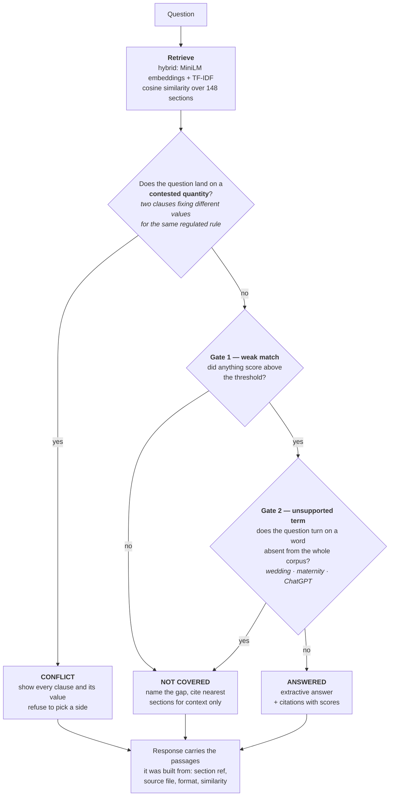

# Rulebook QA — the rulebook that argues with itself

A question-answering service over a university rulebook that does three things a
confident chatbot will not: it **cites the clause** it is quoting, it **admits when
the rulebook does not say**, and it **tells you when the rulebook says two different
things**.

Ask *"what attendance do I need to sit the exam?"* and it does not pick one number.
It reports that AR-3.2 says 75%, AR-7.4 says 65% with a medical certificate, and
EC-3.1 lets a committee waive the requirement altogether — and shows you all three.

---

## Run it

```bash
git clone <this-repo>
cd rulebook-rag

python -m venv .venv
source .venv/bin/activate          # Windows: .venv\Scripts\activate

pip install -r requirements.txt
uvicorn app.main:app --reload
```

Open <http://localhost:8000>. Interactive API docs are at `/docs`.

First start downloads a ~90 MB embedding model. To skip it and run fully offline
on lexical retrieval only:

```bash
USE_DENSE_EMBEDDINGS=0 uvicorn app.main:app --reload
```

### The endpoint

```bash
curl -X POST http://localhost:8000/ask \
  -H 'Content-Type: application/json' \
  -d '{"question": "What is the minimum attendance I need to sit the exam?"}'
```

```jsonc
{
  "response_type": "conflict",          // answered | not_covered | conflict
  "answer": "The rulebook gives more than one answer to this...",
  "citations": [
    { "section_id": "AR-3.2", "heading": "Minimum Attendance for Examination Eligibility",
      "document": "Academic Regulations — B.Tech Programme",
      "source_file": "01_academic_regulations.md", "source_format": "markdown",
      "similarity": 0.6431, "text": "A student must have attended not less than..." }
  ],
  "conflict": {
    "topic_label": "Minimum attendance required to appear in the end-semester examination",
    "claims": [
      { "section_id": "AR-3.2", "stated_value": "75%",  "kind": "value",    "sentence": "..." },
      { "section_id": "AR-7.4", "stated_value": "65%",  "kind": "value",    "sentence": "..." },
      { "section_id": "EC-3.1", "stated_value": "may be waived entirely", "kind": "override", "sentence": "..." }
    ]
  },
  "reasoning": "3 sections fix different values for the same rule...",
  "retrieval_backend": "hybrid(minilm+tfidf)",
  "answer_backend": "extractive",
  "latency_ms": 41.2
}
```

Other routes: `GET /health` (index stats and the contradictions found),
`GET /corpus` (what was indexed, by document and format), `GET /` (the UI).

### Evaluate

```bash
python evaluate.py            # add -v to print every question
```

---

## What is mocked, and what is not

**The rulebook is written, not real.** The brief allows either a real institution's
regulations or a rulebook you write. This one is written from scratch: five
fictional documents for a fictional university. That was deliberate — the
contradictions had to be planted at known locations to be tested against, and
editing a real university's published regulations to introduce false clauses is a
worse artefact to put in a public repository. It is written in the register of real
academic regulations, with cross-references between documents, and it is 7,207 words.

**Nothing else is mocked.** Retrieval, claim extraction, contradiction detection and
the response-type decision all run for real over the corpus at request time. There
are no canned answers, no hardcoded question-to-answer table, and no list of
"sections that conflict" anywhere in the code — see the note on this below.

**The LLM is optional and off by default.** Answers are assembled extractively from
sentences that exist in the corpus. Set `ANTHROPIC_API_KEY` to have a model rewrite
those same sentences into smoother prose; it is given only the retrieved passages
and instructed to refuse if they do not contain the answer, and if the call fails
the extractive answer is used. No key is needed to run or demo anything.

---

## The corpus

7,207 words across five documents in three formats.

| Document | ID | Format | Contents |
|---|---|---|---|
| `01_academic_regulations.md` | AR | markdown | Registration, attendance, assessment, examinations, grading, exemptions, degree requirements |
| `02_hostel_handbook.md` | HH | markdown | Allotment, conduct, mess, leave, discipline, facilities |
| `03_scholarship_policy.md` | SP | markdown | Merit scholarship categories, renewal, disbursement |
| `04_fee_schedule.md` | FS | markdown **tables** | Fee heads, payment deadlines, refunds, concessions, fines |
| `05_examination_committee_charter.pdf` | EC | **PDF** | Committee composition, examination offences, powers of relaxation |

The PDF is generated by `corpus/_build_pdf.py`, so the repository stays
reproducible rather than carrying an opaque binary.

Chunking is **by section, not by token window**. Every answer has to carry a real
reference like `AR-3.2`, and a fixed-size splitter cuts across clause boundaries
and makes citations meaningless. 148 sections are indexed. Tables are never split
mid-row.

### The three planted contradictions

Recorded in full, with reasoning, in [`tests/contradictions_log.md`](tests/contradictions_log.md).

| # | The contested rule | Clauses | Spans |
|---|---|---|---|
| 1 | Attendance needed to sit the exam | AR-3.2 (75%), AR-7.4 (65% with a certificate), EC-3.1 (waivable) | two documents, markdown + PDF |
| 2 | Notice before an overnight absence from the hostel | HH-4.1 (48 hours), HH-9.3 (24 hours) | one document, five sections apart |
| 3 | CGPA needed to keep a merit scholarship | SP-2.1 (8.00), FS-6.2 (7.50) | two documents, prose + table |

---

## How it decides



**Why the order.** Conflict is checked **before** coverage on purpose: a contested
question is not an unanswered one — the corpus answers it too many times, which is a
different failure and deserves a different response.

**Why two coverage gates.** Gate 1 alone is not enough, and that is the whole
difficulty of this problem. *"What happens if I miss the exam because of a family
wedding?"* retrieves the medical-absence clause with a **high** score, because the
question really is about missing an exam. The passage is topically perfect and
answers a different question. Gate 2 is what catches it.

### Retrieval is hybrid, and that is not decoration

Dense embeddings catch paraphrase: *"how many classes must I attend"* → AR-3.2,
which shares almost no vocabulary with the question. TF-IDF catches what embeddings
are weak at in a legal corpus — exact section IDs, numbers, and rare tokens like
"caution deposit". Neither alone is enough, so the score is a weighted blend
(`DENSE_WEIGHT`, default 0.65). If `sentence-transformers` is unavailable the
service degrades to lexical-only and **says so in every response**, so a demo never
silently misleads you.

### Contradiction detection reads the corpus, it is not told the answer

The naive approach — ask an LLM whether two passages disagree — is unreliable and
unexplainable. Instead the corpus is parsed into **claims**:

> *(regulated quantity, value, the sentence stating it, section id)*

Two claims on the same quantity with different values are a conflict. A clause
asserting a *power to waive* a quantity conflicts with any clause that fixes it.

What is declared in `app/claims.py` is the list of regulated *quantities*
(attendance-for-exam-eligibility, scholarship-retention CGPA, hostel leave notice).
What is discovered at runtime is the **values**, the **sentences**, and **which
sections collide**. The detector is never told that AR-3.2 and AR-7.4 disagree — it
finds that by reading them. Delete a contradiction from the corpus and it stops
being reported, with no code change. `GET /health` lists what it found.

A fully generic detector — *two numbers, same unit, similar surrounding text* — was
tried first and over-triggered badly. AR-4.3 (medical certificate within **seven**
working days of a mid-semester test) and AR-5.4 (within **ten** working days of an
end-semester examination) are near-identical in wording and both state a deadline in
days, but they govern different events and are perfectly consistent. Telling them
apart requires knowing *what the number measures*, which is what a declared quantity
encodes. Those near-misses are kept as negatives in the evaluation set.

### Saying "not covered" is harder than a threshold

This is the part that separates the system from a confident-sounding chatbot.

Ask *"what happens if I miss the exam because of a family wedding?"* and retrieval
returns AR-5.4 — medical absence from the end-semester examination — with a **high**
score, because the question really is about missing an exam. The passage is
topically perfect and answers a different question. A threshold-only system answers
it confidently and wrongly.

So there are two gates:

1. **Weak match.** Nothing scored above `WEAK_MATCH_THRESHOLD`. The corpus is not in
   the neighbourhood at all.
2. **Unsupported circumstance.** The question turns on a term that appears **nowhere
   in the corpus vocabulary** — *wedding*, *quarantine*, *maternity*, *ChatGPT*. If a
   word is absent from the whole rulebook, no clause in it is about that
   circumstance, however well the surrounding words match. It fires only on content
   words, never on question scaffolding, and it resolves morphology and
   abbreviations first so *"exam"* still matches a corpus that writes
   *"examination"*.

Gate 2 does most of the work and its reason is shown in the UI, so you can see
exactly which word made the system withhold an answer.

---

## Results

`python evaluate.py`, scored on the lexical-only backend so the numbers hold in the
worst configuration:

| Set | Questions | Correct |
|---|---|---|
| Answered — questions the corpus answers cleanly | 20 | **20/20** |
| Not covered — adversarial, plausible, adjacent | 25 | **25/25** |
| Conflict — landing on the planted contradictions | 7 | **7/7** |
| Near miss — look like conflicts, are not | 3 | **3/3** |
| **Total** | **55** | **55/55** |

The expected clause appears in the citation list for **20/20** answerable questions,
and all **17** clauses across the three contradictions are surfaced whenever a
conflict is reported — a conflict that names only one of its sides is not much use.

Test sets live in `tests/`. The 25 adversarial questions each record the clause a
naive system is most likely to misapply, and why it does not actually apply.

---

## Limitations

Stated rather than hidden, because the point of this system is not overclaiming.

- **Gate 2 needs an out-of-vocabulary term.** A question phrased entirely in
  rulebook vocabulary can still be unanswerable and will slip through as
  `answered`. *"Can I appeal a re-evaluation result?"* is only caught because
  "disagree" is absent; rephrased carefully it would pass. Catching that class
  properly needs clause-level entailment, not vocabulary.
- **Regulated quantities are declared.** New kinds of contradiction need a new
  entry in `QUANTITIES`. The values and collisions are found automatically, but the
  detector will not notice a contradiction about something nobody declared as a
  regulated quantity.
- **Only numeric and override conflicts are detected.** Two clauses that disagree
  purely in prose — one permitting what another forbids, with no number involved —
  are not caught.
- **Section-level chunking is coarse for long tables.** FS-3 and FS-4 are single
  chunks, so a question about one row retrieves the whole table and the similarity
  score is diluted.
- **Thresholds are tuned on this corpus.** `WEAK_MATCH_THRESHOLD` is set for these
  documents and these score distributions; a different corpus would need
  `evaluate.py` re-run to re-tune it.

---

## Layout

```
app/
  main.py            FastAPI: POST /ask, /health, /corpus, and the UI
  models.py          Pydantic request/response schemas
  corpus_loader.py   markdown + table + PDF loading, section-level chunking
  retriever.py       hybrid dense/lexical retrieval, cosine similarity
  claims.py          claim extraction and contradiction detection
  coverage.py        the two not-covered gates
  answerer.py        response construction for all three types
  config.py          every threshold, in one place
corpus/              the rulebook (5 documents, 3 formats)
static/index.html    single-page UI, no build step
tests/               test sets and the planted-contradiction log
evaluate.py          scores all four sets and prints per-set accuracy
```

Configuration is by environment variable: `USE_DENSE_EMBEDDINGS`, `DENSE_WEIGHT`,
`WEAK_MATCH_THRESHOLD`, `EMBEDDING_MODEL`, `ANTHROPIC_API_KEY`, `USE_LLM`.
